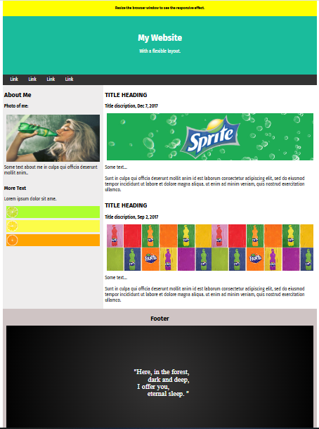

# Landing Page (HTML + CSS)

This project is a landing page I created using pure HTML and CSS.

🎯 **Project Goal:**  
A practice project focused on building a single-page layout with section-based structure, element positioning, and basic styling using CSS animations.

🛠️ **Technologies:**

- HTML5  
- CSS3 (Flexbox, CSS Animation)

📁 **Project Structure:**

- `index.html` — main page  
- `page1.html`  
- `style.css` — styles  
- `image.png` — multiple image files  
- `README.md` — project description  
- `preview.png` — project preview / screenshot

📷 **Page Preview:**

⚠️ **Note:**  
The project includes basic CSS tools and animations — for example, animated citrus images. It was created as a static educational page.

👩‍💻 **Author:** Veronika Pavuk
